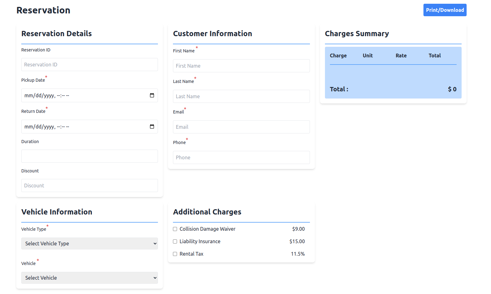
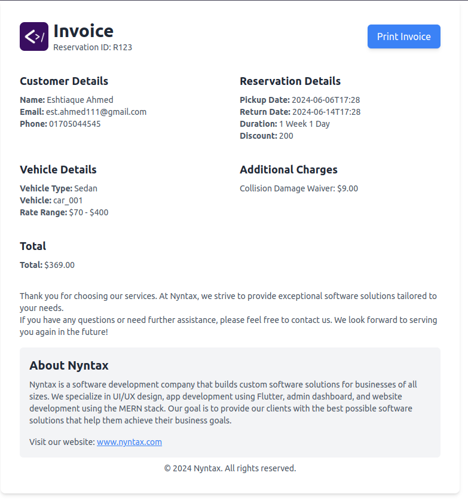

# Invoice Generate
##  Introduction

The "Invoice Generate" project is a simple tool designed to automate the generation of invoices for various products or services. It provides an easy-to-use interface for creating, managing, and retrieving invoices, making it an essential component for any business or individual needing streamlined invoicing solutions.


## Live Link : **[Invoice Generator](https://calm-taiyaki-7b8c53.netlify.app/)**

##  Technology

- **[React.js](https://reactjs.org/)**: A JavaScript library for building user interfaces, allowing developers to create reusable UI components that compose rich, interactive web applications efficiently.

## Question:

Let's say you have a Tesla in your system that charges $10 per hour and $50 per day. What occurs now if the car is rented for six hours? Is the customer willing to pay more than the daily rate for one-fourth of the period? Regarding the hourly, daily, and weekly rate systems, how do you handle this issue? Describe your solution in the readme file of your project.

### Explanation 

#### Renting for 6 Hours

- **Hourly Rate**: $10 per hour
  - Total Cost: 6 hours * $10 per hour = $60
- **Daily Rate**: $50 for a full day
  - Since the rental is less than a full day, the customer still pays $50.

#### Comparison

- If you rent the Tesla for 6 hours, it will cost $60 with the hourly rate, which is more than the $50 daily rate.
- So, in this case, the customer pays more than the daily rate for one-fourth of the time.

### Solution

To handle this, we use different pricing options:

- **Hourly Rate**: Good for short rentals. You pay for the exact time you use.
- **Daily Rate**: Useful for longer rentals. You pay a fixed price for a full day.
- **Weekly Rate**: Gives you a discount for renting for many days.

### How It Works

When you book a car with us, we show you the prices for different times. This helps you see how much it will cost before you rent.

---


##  Quick Start

###  Clone the Repository

```bash
git clone https://github.com/Eshtiaque/Invoice-Generate.git
```
###  Install Dependencies
```bash
npm install  
```
 <br/> (  if you can't run it then install npm globally)

###  Start the Application
```bash
npm run dev
```

### My Invoice 


*Reserve Form*


*Invoice Print*

##  Contact

If you have any questions or need further assistance, please contact est.ahmed111@gmail.com.


---